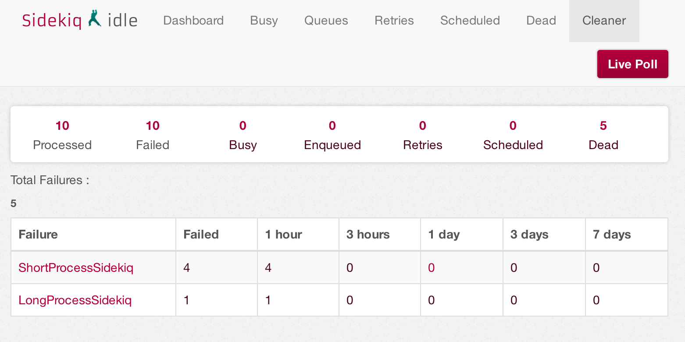
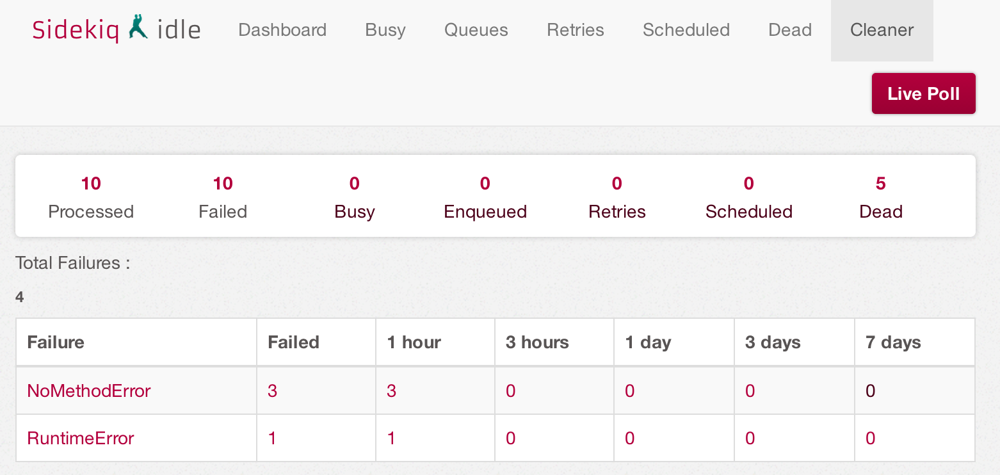

# Sidekiq::Cleaner

Sidekiq cleaner makes exploring dead job queue easier. It breaks down
the failures by time window of hours and days. It allows retrying
or deleting a certain subset of failures.

Failures are also classified based on the error type. A screenshot of the
errors categorized based on the task is below

Click on the error counts to break down to classify the
number of failures per error class as shown in the image below

#### NOTE: This gem requires Sidekiq > 3.0

## Installation

Add this line to your application's Gemfile:

    gem 'sidekiq-cleaner'

And then execute:

    $ bundle

Or install it yourself as:

    $ gem install sidekiq-cleaner

## Usage

TODO: Write usage instructions here

## Contributing

1. Fork it ( http://github.com/<my-github-username>/sidekiq-cleaner/fork )
2. Create your feature branch (`git checkout -b my-new-feature`)
3. Commit your changes (`git commit -am 'Add some feature'`)
4. Push to the branch (`git push origin my-new-feature`)
5. Create new Pull Request
