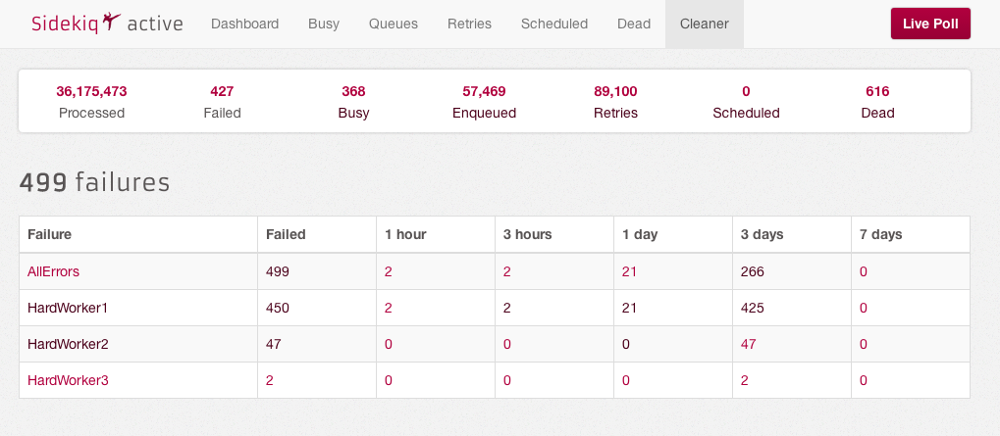
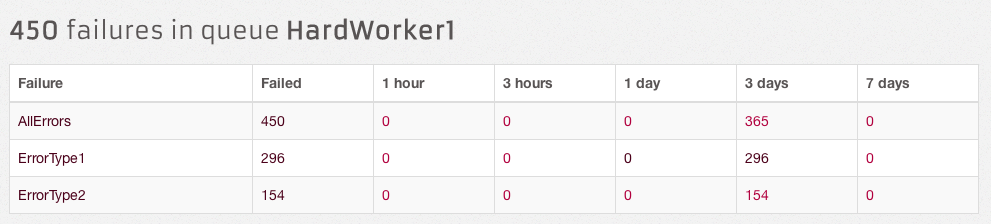
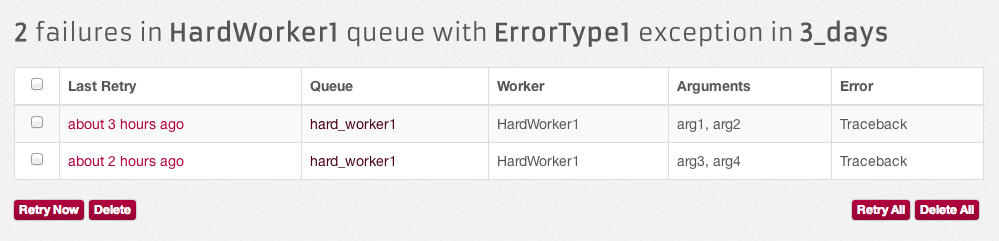

# Sidekiq::Cleaner

Sidekiq cleaner makes exploring dead job queue easier. It breaks down
the failures by time window of hours and days. It allows retrying
or deleting a certain subset of failures.

Queue based failure classification

For each queue, you can drill down to view failure distribution based on
error types.

Finally, click on the individual error counts to display details of the
errors in a list form.

#### NOTE: This gem requires Sidekiq > 3.0

## Installation

Add this line to your application's Gemfile:

    gem 'sidekiq-cleaner'

And then execute:

    $ bundle

Or install it yourself as:

    $ gem install sidekiq-cleaner

## Contributing

1. Fork it ( http://github.com/<my-github-username>/sidekiq-cleaner/fork )
2. Create your feature branch (`git checkout -b my-new-feature`)
3. Commit your changes (`git commit -am 'Add some feature'`)
4. Push to the branch (`git push origin my-new-feature`)
5. Create new Pull Request
